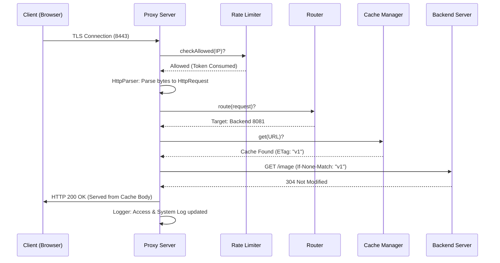

# 🛡️ Educational Reverse Proxy: Ultra-Detailed Technical Manual

This manual provides a line-by-line and logic-by-logic breakdown of the entire Reverse Proxy architecture.

---

## 1. Sequence Diagram: The Request Lifecycle



---

## 2. Core Component Deep-Dive

### 📂 [ProxyServer.java](file:///home/zeyad/work/Study/SideProjects/Reverse-Proxy/src/main/java/com/reverseproxy/core/ProxyServer.java)
**Purpose**: The main acceptor loop and dependency injector.
*   **Line 30**: `ProxyConfig config = ProxyConfig.load(CONFIG_FILE);`
    *   This is the first thing that happens. We load all settings (ports, backends, limits) into a central object.
*   **Line 49**: `SSLServerSocket serverSocket = (SSLServerSocket) ssf.createServerSocket(config.port);`
    *   This starts the "Listener." It performs the **TLS Handshake**. If the client doesn't have the right certificate info, the connection is dropped here.
*   **Line 55**: `while (true) { Socket clientSocket = serverSocket.accept(); ... }`
    *   The "Infinite Loop." Every time a user connects, we create a new `Socket` and immediately pass it to a background thread (`workerPool`). This ensures the proxy can handle many users at once.

### 📂 [ClientHandler.java](file:///home/zeyad/work/Study/SideProjects/Reverse-Proxy/src/main/java/com/reverseproxy/core/handler/ClientHandler.java)
**Purpose**: The "Orchestrator" for a single client connection.
*   **Keep-Alive Loop**: `while (handledRequests < maxKeepAliveRequests)`
    *   This allows the proxy to reuse the same TCP connection for multiple requests from the same user, which is 10x faster than opening a new one every time.
*   **Rate Limiting**: Before doing any work, it calls `TokenBucketRateLimiter.tryConsume(clientIp)`. If this returns `false`, we immediately send a `429 Too Many Requests` and close the connection.

### 📂 [HttpParser.java](file:///home/zeyad/work/Study/SideProjects/Reverse-Proxy/src/main/java/com/reverseproxy/core/parser/HttpParser.java)
**Purpose**: Converting raw network bytes into a usable Java Object.
*   **Line-by-Line Reading**: It reads bytes until it finds `\r\n` (CRLF). 
*   **The Request Line**: The first line is split into 3 parts: `Method` (GET), `Path` (/hello), and `Version` (HTTP/1.1).
*   **Header Map**: It stores all headers in a `Map<String, String>`. Note that we make header names Case-Insensitive by converting them to lowercase during storage.

### 📂 [ProxyEngine.java](file:///home/zeyad/work/Study/SideProjects/Reverse-Proxy/src/main/java/com/reverseproxy/core/ProxyEngine.java)
**Purpose**: The actual "Bridge" and Caching Logic.
*   **Conditional GET Logic**: 
    ```java
    if (cached != null) {
        backendOutput.write(String.format("If-None-Match: %s\r\n", cached.getEtag()).getBytes());
    }
    ```
    This is the "Smart" part. We tell the backend we already have a copy.
*   **The 304 Optimization**: 
    If the backend status is `304 Not Modified`, we skip the backend's empty body and instead dump our `cached.getBody()` directly to the client's output stream.
*   **Byte-Streaming (Crucial)**: 
    ```java
    byte[] buffer = new byte[8192];
    while ((bytesRead = backendInput.read(buffer)) != -1) {
        clientOutput.write(buffer, 0, bytesRead);
    }
    ```
    We use an 8KB buffer. This means if you are proxying a 1GB file, the proxy **never** loads the whole 1GB into RAM. It just moves 8KB at a time like a water pipe.

### 📂 [Router.java](file:///home/zeyad/work/Study/SideProjects/Reverse-Proxy/src/main/java/com/reverseproxy/core/routing/Router.java)
**Purpose**: Deciding the destination.
*   **Sticky Sessions**: It looks for the `PROXY_ID` cookie. If it finds `backend_1`, it ignores the Round Robin and sends the user back to server #1. This is vital for applications that store login sessions in memory.
*   **Health Awareness**: It checks `backend.isClosed()` before picking it. If the Heartbeat marked a server as DOWN, the Router skips it automatically.

### 📂 [HealthChecker.java](file:///home/zeyad/work/Study/SideProjects/Reverse-Proxy/src/main/java/com/reverseproxy/core/health/HealthChecker.java)
**Purpose**: The background monitoring service.
*   **Scheduled Task**: Runs on a `SingleThreadScheduledExecutor`. It doesn't care about traffic; it pings every second.
*   **Self-Healing**: When a backend "wakes up" and responds to a ping, the HealthChecker calls `backend.resetFailures()`. This immediately tells the `Router` that the server is healthy again.

---

## 3. Concurrency & Thread Safety

In a Reverse Proxy, multiple users hit the code at the same time. We used special tools to prevent "Race Conditions":

1.  **`ConcurrentHashMap`**: Used in `RateLimiter` and `CacheManager`. Unlike a normal `HashMap`, it allows multiple threads to read and write at the same time without crashing or corrupting data.
2.  **`AtomicInteger`**: Used for the Round Robin counter. If two users hit the proxy at the exact same millisecond, `AtomicInteger` ensures they get two different numbers (e.g., User A gets server 1, User B gets server 2).
3.  **`synchronized` methods**: Used in the `Logger` to ensure that logs from different threads don't get mixed up in the middle of a sentence.

---

## 4. How to Read the Logs like a Pro

Your `system.log` is a storybook of the proxy's life:

*   **`[RATELIMITER] IP ... rejected`**: Someone is trying to attack you or refreshing too fast.
*   **`[ROUTER] Sticky session found`**: The user is a returning visitor.
*   **`[CACHE] HIT! Backend returned 304`**: The proxy saved bandwidth and time.
*   **`[HEALTH] Backend ... went DOWN`**: A server crashed, and the proxy is now protecting the users from it.

---

## 5. Future Maintenance
To add a new backend, simply edit `config.json` and add an entry to the `backends` array. The proxy will pick it up on the next restart, and the **Health Checker** will immediately start monitoring it!
